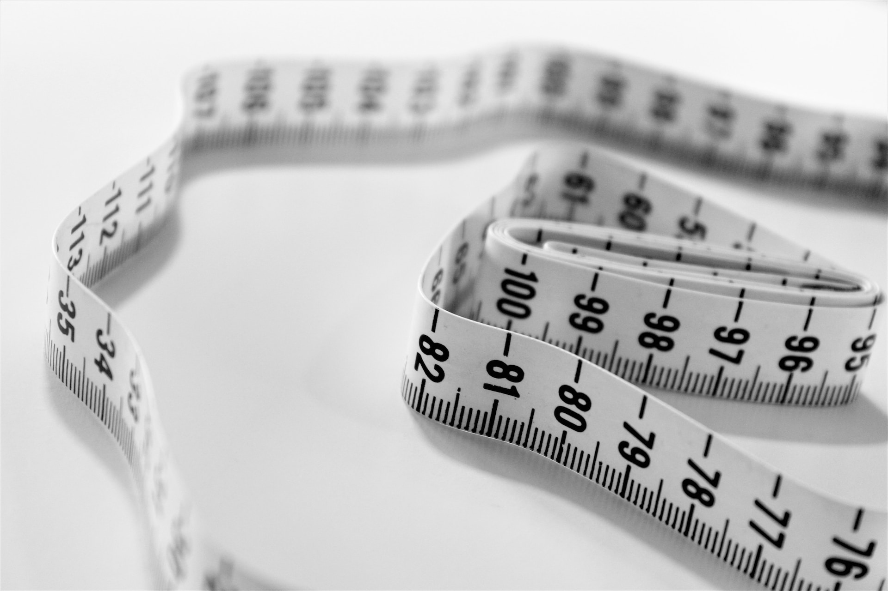

# Size




You can specify the HEIGHT and WIDTH of the Image in Pixels.

It can be passed with short form option `-s` or long form option `--size` and passing 2 arguments which corresponds to the Height and Width of the Image respectively.


## Examples


```bash
blankimage --size 2000 4000
blankimage -s 50 10
```

## Size Limitations

Although there are no limitations on the Input, It should be a Positive Integer that should not be too big.
It might take longer to generate a image with too many pixel and the time depends on the machine specifications.
Test your machine with smaller dimensions before moving to larger dimension images.


:::danger
Too large image will increase load on the machine and might crash.
:::

## Default

:::tip Default Color

The default width and height is 1080 Pixels.
ie., 1080 x 1080 Image

:::

